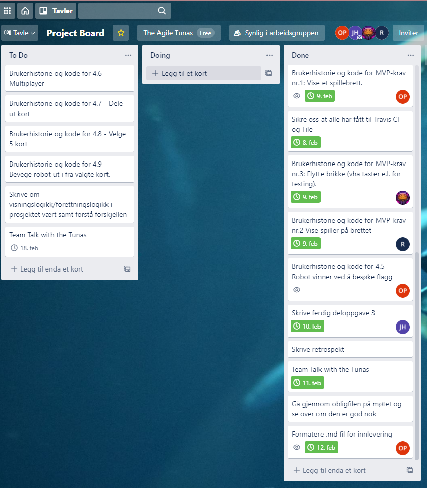

# The Agile Tunas

## DELOPPGAVE 1

### Prosess- og prosjektplan:

**Jacob:**
God  erfaring med praktisk og teoretisk ledelse og teamarbeid etter å ha gått Befalsskole i Forsvaret.
Har gått 3 år på Norges Handelshøyskole der psykologi og ledelse er  godt integrert i fagplanen. Har
tilbrakt	vesentlig tid i studentforeningen NHHS. Jobbet gjentatte ganger som  gruppemedlem eller gruppeleder.
Personlighetstype INTJ eller ENTJ.

**Robin:**
Har bachelor i petroleumslogistikk, har drevet med idrett i norgestoppen. Liker å ha det kjekt.
Personlighetstype ENTJ-A.

**Olesya:**
Bred erfaring innenfor kreativt arbeid. Vært i norgestoppen innenfor mitt fagområde, der vi ble bedømt av anerkjente personligheter i bransjen. Liker å kommunisere med andre. Personlighetstype ESFJ.

**Lisa:**
Lang erfaring med lagkommunikasjon i pressede/stressende situasjoner der        
konkurranse og teamarbeid er essensielt for gode resultater.
Personlighetstype: INFJ.

**Rolleinndeling:** Jacob Hagan (Utvikler), Robin Lange (Teamlead, utvikler), Olesya Pasichnyk (Kundekontakt, utvikler), Lisa Eliassen (Utvikler).

**Kommentar til rolleinndeling:** Robin ble teamlead fordi det er en egenskap han vil utvikle, og at dette er en god mulighet for å utøve praktisk lederskap under kontrollerte former. Olesya ble kundekontakt fordi hun liker å kommunisere og det å være et mellomledd mellom kunden og teamet passet dermed godt for henne.

Trello-board 11.02.2021:

Link til trello-board: https://trello.com/b/9pKSo8yI/project-board. 

## DELOPPGAVE 2 - Prosjekt- og prosessplan

Av prosjektmetodikk har vi landet på en en kombinasjon av Scrum og Kanban. Da prosjektet vi skal utføre har gitte tidsfrister virker Scrum som et hensiktsmessig verktøy for å sikre at gitte arbeidsoppgaver blir utført til korrekt tid. På denne måten ser vi for oss å opprettholde en god oversikt over hvilke arbeidsoppgaver som gjenstår slik at vi kan unngå unødvendig stress og skippertaksarbeid kvelden før fristen. For å kunne holde god oversikt over hvilke oppgaver som skal og må gjøres benytter vi Kanban. Vi har opprettet et Project Board med Trello slik at vi kan visualisere arbeidsprosessen og øke effektiviteten ved at alle er på samme side når det kommer til oversikt over arbeidsoppgavene til den enkelte.
Måten vi kombinerer Scrum og Kanban er ved hjelp av tidsfrister på arbeidsoppgavene som er hengt opp på vårt Project Board. Vi tror dette vil skape en robust plattform som vil være både effektiv og oversiktlig.

Når det kommer til det rent praktiske rundt oppgaven vil vi tilstrebe å gjennomføre en samarbeidsrettet arbeidsmetode.
Vårt andre møte sammen gikk i all hovedsak til å utarbeide en kontrakt for hvordan vi ønsker å ha det i teamet. Brorparten av det 2 timer lange møtet gikk til å diskutere de ulike elementene som kontrakten tar for seg. Det å være proaktiv viser seg ofte å være det beste, så ved å gå gjennom ulike tenkte scenarier som kan komme til å oppstå er vi alle trygge på hvordan vi skal gå fram.

Måten vi ønsker å organisere prosjektet på den første tiden er å aktivt benytte oss av Trello og det project-boardet vi har der. Vi sikter på å ha minst 2 møter i uken á 2 timer hver. Med mulighet og åpenhet om mer enn dette om det skal være nødvendig. Ved å starte og avslutte hvert møte med å oppdatere det i henhold til den progresjonen vi har hatt, tror vi at vi vil kunne holde en god oversikt over hva alle i teamet jobber med, samt kunne ha en totaloversikt over hvor i prosessen vi er. Vi oppdaterer de aller fleste oppgaver på en måte der man kan se hvem som skal utføre en oppgave og når oppgaven skal være gjort til. Siden vi har en tidsfrist for innlevering av prosjektet virker dette som en tilfredstillende måte å organisere oss på.
Vi har valgt å benytte oss av Discord som kommunikasjonsplattform. Der deler vi lenker eller bilder med hverandre. Vi har og opprettet en egen discord-chat der vi kan ha videomøter om det skulle være nødvendig. Med dokumenter der alle skal ha mulighet til å skrive og redigere i sanntid benytter vi oss av google docs. Her har vi skrevet blant annet team-kontrakten da alle skulle skrive inn sine sterke og svake sider.
For detaljer omkring møtedeltakelse, konfliktløsning, uforutsette hendelser, forventningsavklaring osv. legger vi ved kontrakten i sin helhet.

## DELOPPGAVE 3 - Forventet produkt

Det overordnede målet for applikasjonen vil  i første iterasjon være å skape et solid fundament hvor videre utvikling kan foregå på en ryddig og effektiv måte. Til dette trenger vi å implementere de mest grunnleggende funksjonene til spillet. Herunder å vise brettet med tilhørende brikker, kunne flytte på brikkene samt utvikle en seiersbetingelse.
Vi har valgt å prioritere de enkleste funksjonene i spillet først. Dette er et valgt tatt på bakgrunn av at ingen av oss har særlig erfaring med spillutvikling tidligere, og vi tror det vil lønne seg å få satt seg godt inn i det grunnleggende før man bruker for mye tid på noe man ikke vet man får fullført til fristen. Dog er det en intern prioritet i gruppen å få sett på en multiplayer-løsning så fort de 5 første punktene er ferdig. Det er det punktet som virker mest krevende og behøver mest tid for å sette seg inn i. Men siden det ikke er et krav for å få spillet til å fungere har vi valgt å prioritere det noe lavere.

### Brukerhistorier

#### Brukerhistorie MVP 1 - Vise et spillebrett

Som en spiller
ønsker jeg å se spillebrettet
slik at jeg kan få en oversikt over objektene og planlegge spillet mitt.

Løsningsbeskrivelse:
Lage spillebrettet i Tiled og lage kode i IntelliJ for å vise det.

Akseptansekriterier:
Gitt at spillebrettet vises på skjermen så skal
spilleren ha en formening om dimensjonene til brettet,
hvor de ulike objektene er samt startposisjonene.

#### Brukerhistorie MVP 2 - Vise brikke på spillebrett

Som en spiller
ønsker jeg at brikken som jeg kontrollerer skal dukke opp på
brettet i den posisjonen som jeg har fått tildelt.
I første grad skal brikken vises i startposisjon 1.

Løsningsbeskrivelse:
Skrive inn kode som gjør at bretter putter spillerbrikken
på brettet i den riktige startposisjonen sin.

Akseptansekriterier:
Gitt at brettet er synlig så skal spilleren kunne se
brikken sin på brettet i den tildelte startposisjonen sin.

#### Brukerhistorie MVP 3 - Flytte brikke (vha taster e.l. for testing)

Som en spiller
ønsker jeg at det er mulig å flytte brikken som representerer en robot i spillet,
slik at brikken flytter seg slik som jeg har planlagt.

Løsningsbeskrivelse:
Lage en metode som tar inn keycodes og differensierer mellom de fire ulike tastetrykkene: pil opp, pil ned, venstre pil og høyre pil.
Metoden skal flytte brikken i henhold til piltastenes keycode.

Akseptansekriterier:
Gitt at brikken er flyttbar, så skal jeg kunne se at brikken flyttes riktig i henhold til tastetrykk.

#### Brukerhistorie MVP 4 - Robot besøker flagg

Som en spiller ønsker jeg å kunne besøke flagg slik at jeg kan gjøre fremskritt i spillet.

Løsningsbeskrivelse:
Roboten må kunne bevege seg iht. de instruksjonene den har fått, samt at spillet må registrere at en robot står på flagget.
En Robot-klasse vil da trenge en teller eller en boolean verdi for at man skulle bekrefte dette.

Akseptansekriterier:
Gitt at roboten kan besøke et flagg må flagget være synlig på brettet slik at en spiller kan planlegge ruten mot det.
Gitt at roboten kan besøke et flagg må vi vite hvor roboten er til en hver tid slik at vi kan bekrefte om den står på et flagg eller ikke.

#### Brukerhistorie MVP 5 - Robot vinner ved å besøke flagg
Kommentar: vi vil senere utvide denne brukerhistorien når spillet blir mer komplisert.

Som en spiller
ønsker jeg å vinne når jeg besøker flagg
slik at jeg fullfører spillet.

Løsningsbeskrivelse:
Skrive kode i IntelliJ som endrer ikonet til spilleren når spilleren besøker flagg.

Akseptansekriterier:
Gitt at spilleren vinner ved å besøke flagg skal ikonet til spilleren endres
til vinner-ikonet slik at spilleren vet at hun/han har vunnet. 

## DELOPPGAVE 4 - Kode

### Manuell testing

#### Manuell test for brukerhistorie 1
Gitt at spillebrettet vises på skjermen så skal
spilleren ha en formening om dimensjonene til brettet,
hvor de ulike objektene er samt startposisjonene.

For å teste dette starter vi med å kjøre main-metoden i programmet. Ønsket resultat av dette er at brettet gjør seg synlig.
Vi kan visuelt bekrefte dette. 

#### Manuell test for oppdatering av spillerposisjon
Med å bruke Intellij's debugger så kan vi se de ulike variablene som skal oppdateres. 
Vi oppdaget en bug i koden når det kom til oppdateringen av robotens posisjon. Til tross for denne feilen så
fungerte fremdeles alt som det skulle. Vi fant ut hvorfor gjennom debugeren, og endret koden

#### Visuell test for brukerhistorie 2

Gitt at spillerbrettet vises på skjermen skal spilleren
ha en formening om brettet og posisjonen til roboten sin
samtidig med alle de andre elementene på brettet. 
Slik kan da spilleren planlegge sin rute mot målet.

### Retrospekt

#### Hva gikk bra?
Vi følte vi fikk igjen for å ha brukt tid i starten til å bli bedre kjent. Dette gjorde at vi holdt en god tone og klarte å kommunisere mer effektivt. Vi lagde en team-kontrakt der vi fikk snakket om hva vi forventet av hverandre hva vi forventet å få ut av dette prosjektet. Dette hjalp oss mye ved at vi alle var på samme bølgelengde når vi startet. Vi har klart å jobbe jevnt og hatt god kommunikasjon hele veien.
Prosjektmetodikken vi valgt viste seg å passe fint til denne typen arbeid, og vi klarte å bruke Trello aktivt til å holde orden på alle arbeidsoppgaver.
I henhold til team-kontrakten ble alle planlagt møter gjennomført på en effektiv og ryddig måte.
Noe som og var veldig bra var at alle i gruppen viste initiativ når det kom til uløste arbeidsoppgaver.
Alle i gruppen viste egeninitiativ, noe som hjalp veldig med å få gjort alle oppgavene på project board.

#### Hva kunne gått bedre?

Det største forbedringspotensialet var nok absolutt arbeidsfordelingen. Den kunne vært mer tydelig for hver enkelt oppgave slik at de blir lettere å fordele mellom oss. Til tider kunne det være noe utydelig skille mellom hvem som gjorde hva, slik at oppgaver som kunne vært gjort tidligere ble noe utsatt i vente på avklaring.
Vi lærte at parprogrammering kan bli litt kaotisk om man er flere enn 2 personer samtidig og at det da er desto viktig med klare skiller mellom hvem som gjør hva.
Møtene kunne og vært strukturert bedre. Vi tror man ville vært tjent med en klarere struktur på hva møtene skal inneholde før møte, slik at alle har en klar formening om hva som skal foregå.

#### Hvordan fungerte det tekniske?

Code with me fungerte bra, gitt at man ikke er for mange som jobber med samme oppgave.
Møter på discord har fungert bra. Alle har vist respekt for hverandres meninger og det har vært lite misforståelser basert på verbal kommunikasjon.
Google docs har fungert fint til å skrive dokumenter i fellesskap.
Trello har fungert veldig bra til å holde orden på prosjektet og dets arbeidsoppgaver. Enkelt å sette frister og tagge hvilke personer som jobber med hva.

#### Hva vil vi gjøre annerledes neste gang?

Et fokusområde fram mot neste innlevering blir  å lage klarere roller innad i gruppen. På denne måten håper vi å oppnå er mer naturlig ansvarsfordeling basert på den enkeltes styrker. Det vil og tydeliggjøre skille mellom hvem som gjør hva.  Arbeidsoppgaver i Trello kan spesifiseres enda mere for å gjøre det veldig klart hvilke oppgaver det gjelder og hvordan man vet om man er ferdig.
Vi vil forsøke å lage en agenda på forhånd av hvert møte slik at alle er på samme side når det gjelder hva møte skal handle om og om man må forberede noe.
Neste gang vi skal parprogrammere skal vi prøve å holde en tydeligere kommunikasjon omkring hvem som gjør hva og hvor de gjør det i koden. Målet blir å unngå den klassiske “Flere kokker, mere søl”

### Veien videre:

Alt i alt er vi veldig fornøyde med hvordan det har vært å jobbe sammen. Vi har kommet godt overens og lært hverandre bedre å kjenne. Med fokus på hva vi har av forbedringspotensiale har vi tro på at gruppen vil prestere godt sammen dette semesteret. 
