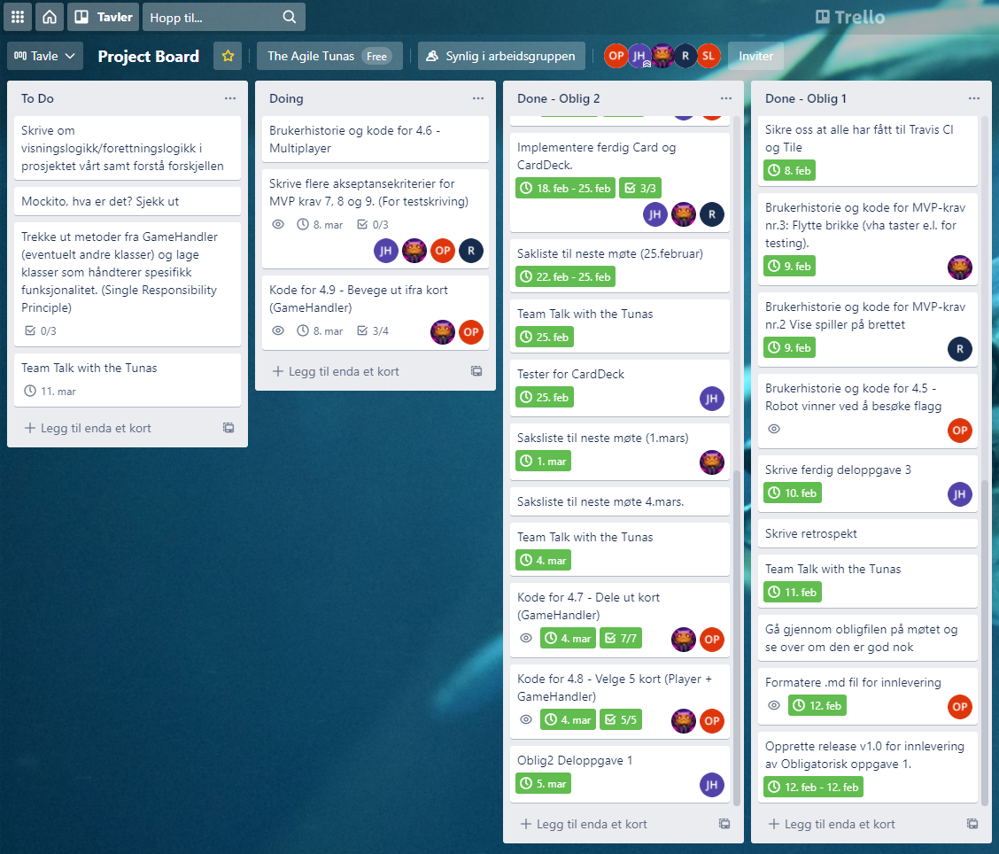

# The Agile Tunas

### DELOPPGAVE 1 - Prosjekt og prosjektstruktur

Etter obligatorisk oppgave 1 så viste det seg at Jacob passet mer og mer inn som teamleader.
Så han tok over denne posisjonen, noe han syns var helt greit.

## Prosjektmetodikk

Foreløpig har trello fungert godt til å fasilitere for vår prosjektmetodikk. 
En blanding av scrum og kanban fungerte veldig bra med tanke på tidsfrister og oversikt. 
Vi ser for oss å fremdeles oppdatere det i slutten av hvert møte, 
og på den måten fremdeles opprettholde en oversiktlig struktur over prosjektet.

## Rollene i teamet:

Etter hvert som kodebasen blir mer omfattende tror vi det vil være fordelaktig
å ha en rolle som innebærer et overordnet ansvar over koden
og hvordan alt henger sammen. Dette innebærer ikke nødvendigvis at vedkommende
skal skrive noe mer kode, men heller at man har et ansvar om  å følge opp andre
og at all nødvendig dokumentasjon er på plass.

# Team Lead:

Team lead skal holde oversikt over prosjektet som helhet. 
Det innebærer å forsikre seg om project board er oppdatert og at alle vet hva som må bli gjort og har
blitt gjort. Holde laget ved godt mot og motivere samt hjelpe de andre på laget om dette 
skulle bli nødvendig. Team leder har vært flink til å kalle inn til ekstra møter når dette
har vært nødvendig. For å finne ut hvor vi står og veien videre, om vi prioriterer ressursene våre 
riktig eller ikke. Dette skjedde med Robin sin del, her bestemte Robin og Jacob seg at vi måtte
bare avbryte Robin sin del og fortsette med noe annet.

# Kundeansvarlig:

Kundeansvarlig skal ha primærkontakt mellom teamet og kunden. 
Om vi har spørsmål omkring prosjektet vil kundeansvarlig fungere som kommunikasjonskanalen
mellom kunde og team.

# Kodeansvarlig:

Som nevnt ser vi for oss at rolleinnehaveren skal ha ansvar for selve koden. 
Det vil innebære å forsikre seg og sjekke at koden er tilstrekkelig dokumentert, 
at det eksisterer tester til det som skal testes, samt at koden holder et jevnt godt nivå.

## Lagets erfaringer

Foreløpig har trello fungert godt til å fasilitere for vår prosjektmetodikk. 
En blanding av scrum og kanban fungerte veldig bra med tanke på tidsfrister og oversikt. 
Vi ser for oss å fremdeles oppdatere det i slutten av hvert møte, 
og på den måten fremdeles opprettholde en oversiktlig struktur over prosjektet.

### Hvordan er gruppedynamikken?

Gruppedynamikken er det så langt ingenting å utsette på. 
Kommunikasjonen går fint og alle virker trygge på resten av teamet.
Vi har funnet ut hva slags oppgaver noen foretrekker fremfor andre og gir ut oppgavene
ut ifra dette.

# Hvordan fungerer kommunikasjonen for dere?

Vi benytter oss av Discord for all kommunikasjon. 
Dette fungerer fint da terskelen er veldig lav for å skrive noe til resten av gruppen.

## Retrospekt

Ved forrige retrospekt ble vi enige om å konkretisere rollene og den enkeltes arbeidsoppgaver. 
Vi føler vi har lykkes med dette gjennom å ha opprettet en ny rolle, 
samt fordele oppgaver mer spesifikt. Vi har også blitt flinkere til å lage en formell saksliste
som vi følger i møtene slik at ikke så mye tid går vekk.

#### Hva gikk bra? 

Den fremste styrken vi som gruppe føler vi besitter er evnen til å ta egne tilbakemeldinger for så å korrigere egen
arbeidsmetodikk.
En av punktene vi ville forbedre oss på var å få klarere rollefordeling av oppgavene som skulle utføres. Vi kombinerte 
dette med det faktum at Code with me kunne bli uoversikltig med for mange brukere. Det vi endte opp med var en klar 
deling av arbeidsoppgavene der vi delte oss inn i to par som hadde hovedansvar over sin spesifikke del. 
Dette gjorde kommunikasjonen omkring små detaljer enklere da hele gruppen ikke nødvendigvis må ta del i alle miniskule
beslutninger. Det som utmerket seg fra dette var at det var enklere å tilpasse arbeidstider innad i parene iht. andre 
fag og døgnrytme. Dette igjen første til en enklere klarering når det kom til hvilke spesifikke oppgaver den enkelte 
skulle gjøre. 

#### Hva kunne gått bedre?

Den største utfordingen vi sto ovenfor under dette prosjektet var tidsstyringen. Det var vankelig å få oversikt på
forhånd hvor lang tid de enkelte oppgavene ville kreve. Når vi planla oppgaven mht til arbeidsfordeling og frister la vi
for lite vekt på hvor lang tid de vi antok de ulike oppgavene ville ta. Dette førte til at vi kom under en hvis tidsnød 
i den avsluttende fasen. Dette var selvsagt suboptimalt, men ikke kun et resultat av manglende planlegging. En kombinasjon 
av ulike pressende frister på områder utenfor dette prosjektet for enkelte gjorde at vi ikke fikk lagt inn like mange
timer som vi ideelt kunne ha hatt. 
Sekundært vil vi at den enkelte skal bli flinkere til å spørre andre om hjelp om man sitter fast på noe. Tanken om at
*"Hvis jeg har mye på min tallerken, da har de andre det og"* har noe for seg. Men det er alltid bedre å informere de
andre i tilfelle noen kan avse litt tid for å hjelpe. 

#### Hva vil vi fokusre på fremover?

Fokus framover vil ligge i å vidreføre gode rutiner når det kommer til planlegge møter og arbeidsoppgaver samt utføre en
mer detaljert planlegging i startfasen. Vi har god tro på at dette vil være til hjelp og igjen kunne føre til en mer 
effektiv arbeidsmetodikk for samtlige. 

## Bidrag til prosjektet

Her fikk vi en liten skeivfordeling med tanke på commits, dette har med at Robin sin
multiplayerdel ikke fungerte og han pushet ikke disse små endringene sine. Til slutt så fant laget
ut at Jacob sin del var best. Robin gjorde også mer administrative oppgaver som å skrive ned brukerhistorier 
og slikt. Robin hadde også en hendelse som skjedde i sin familie som gjorde at han ikke fikk jobbet
med så mye skole i innleveringsuken. De andre på laget viste stor forståelse og tok på seg mer arbeid
og ansvar slik at den obligatoriske oppgaven gikk så bra som den gjorde.

Trello-board 05.03.2021:

Link til trello-board: https://trello.com/b/9pKSo8yI/project-board

----------------------------------------------------------------------

## DELOPPGAVE 2 - Krav

Vi hadde møter og diskuterte hva vi såg for oss hva som kom til å bli viktig for prosjektet.
Så vi delte opp de resterende MVP kravene mellom oss fire, Lisa og Olesya tok hånd om 
MVP kravene som gjelder kort, og Jacob og Robin prøvde seg på multiplayer delen. 

Det viste seg fort at alle begge delene var litt mer komplisert og vanskelige enn antatt. 
Som igjen førte til en del frustrasjon og høyere tidsbruk enn planlagt. 

Mot slutten så fikk Lisa og Olesya åpenbart for lite tid til å gjøre ferdig implementasjonen
av MVP krav 9 (å bevege robot utifra program kort). Vi bestemte oss derfor for å gjøre det mulig
for roboten å (visuelt) bevege seg, men ikke på alle mulige måter. For eksempel, man kan ikke se at 
roboten roterer visuelt, men det skrives ut hvilken retning robot har for hvert "steg" i programmet,
i terminalen i stedet. I tillegg kan ikke robot falle ut av kartet akkurat nå, og om robot skal 
bevege seg etter "Move Three"-kortet og står 2 felt unna kanten av kartet, så vil ikke bevegelsen utføres.
Med andre ord: bevegelser der antall felt robot skal bevege seg framover er større en antall felt fra robot
til kanten til kartet.

Vi prioriterte å jobbe med MVP krav 6,7 og 8, og ville se an hvor mye av 9 som vi rakk. 
Siden forrige innlevering, har vi implementasjon for at spilleren får 9 tilfeldige kort fra en kortstokk (CardDeck)
når man starter applikasjonen (MVP krav 7). Disse vil ligge på høyre side av kartet. I tillegg har vi implementert 
at man kan trykke på 5 av de 9 kortene (spillerens hånd) slik at de legges i området under kartet (MVP krav8). 
Når 5 kort er valgt vil roboten automatisk (med en gang) bevege seg til "endepunktet" etter at kortene i programmet 
har blitt "evaluert" (MVP krav 9). Som sagt, mangler det noe implementasjon og ikke all bevegelse kan utføres.
I tillegg ser man ikke hver "move" for seg selv, hele programmet skjer i ett.

### Følgende justeringer ble gjort til MVP-kravene:

- Robin og Jacob måtte endre MVP-krav 6 til å bare få kontakt mellom en server og klienter. Dette skjedde pga. at 
Robin sin implementasjon ikke fungerte og Jacob fant ut at han manglet noe for å få fullført sin versjon.

### Bugs
Om du er sykt flink så fungerer det å trykke midt mellom to av kortene du kan velge (på høyre side) og begge 
vil bli valgt og lagt i program kort listen. Dette gjelder kun de kortene rett overfor hverandre. 

## DELOPPGAVE 3 - Kode

Klassediagrammet vårt er lagt ved i Deliverables: KlassediagramOblig2.png.
Manuelle tester som CardDeck og CardTest passerer ikke lenger. Vi endret på Card-klassen 
slik at den tar inn en texture og prøvde å tilpasse testene til den. Dessverre fikk vi NullPointerException
som vi ikke har fått til å fikse per dags dato. 

### Brukerhistorier

#### Brukerhistorier MVP 6 - Kontakt mellom en Server og flere klienter

#Som host ønsker jeg:

Å kunne starte en server og få en toveis kontakt mellom server og klienter

#Løsningskriterier:

Bruke kryonet og koding til å etablere kontakt mellom partene

#Akseptansekriterier:

Å få tydelig kontakt mellom en server og klienter samt at man kan kommunisere toveis mellom de,
dette gjøres gjennom prints og skriving i en slags for for chat.

#### Brukerhistorie MVP 7 - Dele ut kort

#Som spiller:

Ønsker jeg å få utlevert ni kort fra en bunke som jeg kan se slik at jeg kan basert på kartet 
og kortene jeg får utlevert planlegge min ferd mot de ulike målene mine.

#Løsningsbeskrivelse:

Lage en kode som leverer ut riktig antall tilfeldige kort fra 
bunken til hver spiller som inneholder kun gyldige bevegelser.

#Akseptansekriterier:

Gitt at spillerbrettet, roboten til spiller er synlige og at kortene
er synlige. Så skal jeg kunne legge opp den optimale ruten basert på de trekkene
jeg har fått utlevert.

#### Brukerhistorie MVP 8 - Velge 5 kort

Som spiller:
Ønsker jeg at ut ifra de ni kortene jeg har fått utlevert å velge fem av de som
gjør at jeg mest effektivt kan nå målet mitt og vinne.

#Løsningskriterier:

Gitt at jeg har sett brettet, roboten min og de andre sine roboter og fått utlevert
de ni kortene mine skal jeg kunne velge ut fem av de som passer meg best.

#Akseptansekriterier:

Gitt at spillerbrettet er synlig, jeg kan se min egen robot og de andre sine roboter og
at jeg har fått opp ni kort som jeg velger fem av så skal da roboten min utføre
de fem bevegelsene som jeg har valgt.

#### Brukerhistorie MVP 9 - Bevege robot ut fra valgte kort

#Som spiller:

Gitt at jeg kan se brettet, min robot og de 5 kortene som jeg valgte ut fra de 9 kortene. 
Så skal roboten for hver runde gjøre den aksjonen som jeg valgte, aksjonene utføres fra venstre 
til høyre.

#Løsningskriterier:

Programmere kode slik at spillerene kan se at roboten utfører de aksjonene som de har valgt ut,
den bevegelsen som er gjort forsvinner eller markeres med gjort.

#Akseptansekriterier:

Gitt at alle spillerbrettet er synlig, robotene kan sees, så skal alle robotene utføre
en aksjon for hver runde som de forskjellige spillerene har valgt. 

