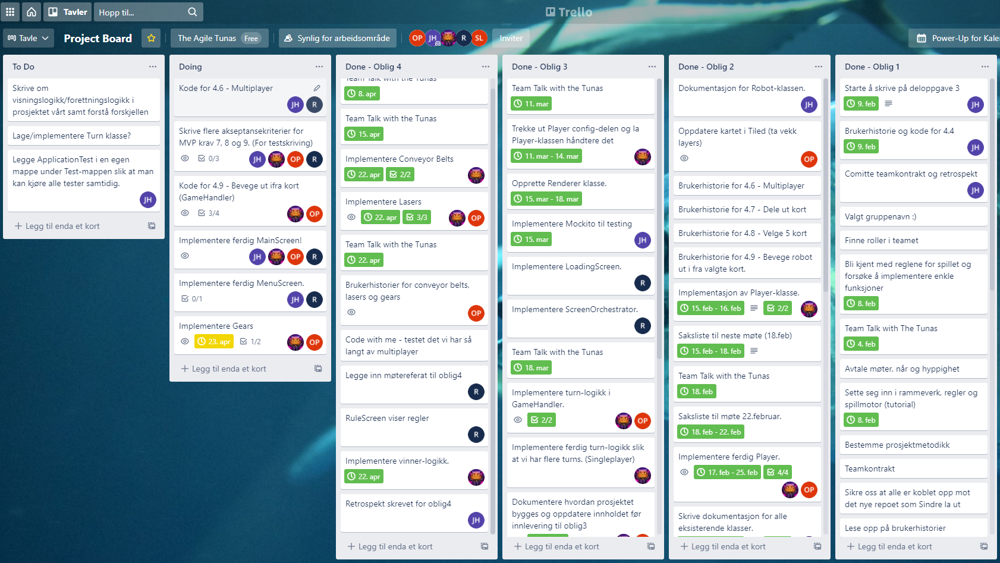

# The Agile Tunas

### DELOPPGAVE 1 - Team og Prosjekt

#### Roller 

Rollene vi opprettet har, sett under ett, fungert godt. Det er lite nevneverdig på dette punktet, da det meste
passer seg bedre i retrospektet.  
Det kan uansett være verdt å nevne de uformelle rollene som har oppstått under prosjektet. Roller som ikke er tildelt,
men som har kommet mer naturlig da enkelte personer har hatt enklere for å gjøre noen oppgaver mer effektivt enn andre. 
Herunder skrive møtereferater, formulere den skriftlige delen, dokumentere kode eller oppdatere Trello. 
Det er helt sikkert flere uformelle roller, men det å komme på alle er ikke alltid like lett da man etter tid kan ta
enkelte roller for gitt, og det virker helt naturlig at noen gjør spesifikke oppgaver. 

#### Teamet

Etter forrige obligatoriske oppgave følte vi at vi var litt bak skjema iht. hva vi ville oppnå som sluttprodukt.
Men vi fikk satt en generell oppgavefordeling, og dette i kombinasjon med en god autonomitet hos den enkelte synes vi at
vi har klart å gjøre mye i den siste tiden. 
Teamet har kommunisert godt. Både i og utenfor de faglige rammene.   
De valgene teamet tok mtp roller og arbeidsfordeling er vi stort sett fornøyde med. Det er og verdt å nevne at
kommunikasjonen har fungert godt når det har kommet til personlige utfordringer den enkelte har hatt. Det har vært
tilfeller av sykdom, strømbrudd, laptoper som har sluttet å fungere etc. Men det viktigste har vært hvordan vi som team
har håndtert uforutsette hendelser. Det er klart at det alltid vil være rom for forbedring, og grep man kunne ha tatt
for å skape en mer sømløs interkasjon innad i teamet. Men noen ting kan man ikke forutse, og vi er stort sett fornøyde
med hvordan vi har håndtert disse sakene. Forståelse og tillit til og for hverandre har vært en viktig nøkkel, og er noe
som vi tror har hatt stor innvirkning på hvordan prosjektet har utartet seg. 

#### Retrospekt

Ved forrige retrospekt la vi fram to punkter vi ønsket å forbedre oss på:
1. Kommunisere tydelig hvilke avhengigheter det eksisterer i prosjektet slik at alle vet hva de burde fokusere på.
2. Jobbe tettere på områder der flere arbeidsoppgaver overlapper.

##### Hva gikk bra?

Vi kan starte med hva som har gått bra i tiden siden forrige innlevering. 
Vi følte vi klarte å jobbe konkret mot de to overnevnte målene vi satt oss. I den siste tiden har vi kommunisert
hyppigere, og brukt mer tid på parprogrammering. Dette skapte en bedre felles forståelse av hva som måtte gjøres, og
hvilke avhengigheter det eksisterte mellom den enkeltets arbeidsoppgaver. Vi jobbet tett, og fikk løst de utfordringene
sto ovenfort sist gang på en tilfredsstillende måte. 

Hvis vi ser på prosjektet som en helhet fra start til slutt, og da spesielt hva som gikk bra, er det flere punkter man
kan trekke frem. Det punket som skiller seg positivt ut må være den interpersonelle relasjonen som har oppstått mellom
medlemmene. Vi brukte mye tid i starten på å bli kjent, og å lære hverandres styrker og svakheter. Dette viste seg å
være en klok avgjørelse, da det bygde et godt fundament der man føler man kan stole på hverandre og man føler seg hørt. 
Å lage et godt fundament og et godt utgangspunkt er kritisk i slike sammenhenger, og vi følte vi var raske med å
identifisere dette. Det hjalp kommunikasjonen gjennom hele prosjektet og terskelen for å be om hjelp, eller spørre om
noe ble veldig lav. 
En annen ting vi følte gikk bra var å benytte oss av ferdighetene til den enkelte. Det å gi arbeidsoppgaver basert på 
komptansefelt gjorde at mange oppgave kunne bli delegert til den som hadde best forutsetninger for å gjøre det. En slik
måte å fordele oppgaver mener vi har vært god, og har både ført til et bedre resultat, samt at den enkelte har tilegnet
seg mer kunnskap om noe man er trygg på. 

#### Hva kunne vi gjort annerledes?

Her kan vi og starte med hva vi ville gjort annerledes den siste tiden.
Når et prosjekt går mot slutten er det ofte man får en litt ekstra boost av motivasjon for å jobbe. Tankene ligger på
prosjektet og man kan oppnå en form for fokalisering på å bli ferdige. Det som da kan oppstå er at man trekker litt unna 
de gode vanene man har lagt seg, og tenker at dette er et unntak da man snart er ferdige. Den siste tiden har vi ikke
vært like flinke til å skrive saksliste til møtene. Dette førte til at møtene fikk en mindre klar struktur, og at man 
gjerne bare hoppet rett inn i Code with Me og begynte å programmere. Dette kan sees på som en mer effektiv måte å jobbe
på, da alle var klar over hva som måtte gjøres og man tenkte at saksliste og Trellooppdateringer bare ble en formell
handling. På den andre siden er det nok desto viktig å opprettholde de gode rutinene når det tetter seg til. Denne 
situasjonen blir litt spesiell da vi ikke nødvendigvis skal jobbe sammen i dette teamet noe mer, men fra et rent 
team-teoretisk perspektiv ville det vært hensiktsmessig å fortsette de gode rutinene hvis man fremdeles skulle ha jobbet
på samme måte i tiden fremover. 

Når man ser på prosjektet som en helhet er det flere punkter man kan trekke frem. Noe annet hadde vært særdeles uvanlig.
Det som står igjen som det viktigste læringspunktet er nok viktigheten av god planlegging. Herunder arbeidsfordeling,
informasjonsoverføring, forventningsstyring og kompetanseavklaring. En grundigere gjennomgang av disse i starten av
prosjektet ville nok vært et smart trekk. Det skal nevnes at dette er enklere å se i etterkant enn det var der og da. 
Men noe man absolutt kunne gjort anderledes var å planlegge prosessen og å sette seg tydelige mål for hvor langt man 
ønsket å komme seg for hver iterasjon av prosjektets faser. Dette hadde hjulpet både for å klargjøre arbeidsfordelingen,
og kunne skap større motivasjon og mestringsfølelse hos den enkelte. Å ha klare mål å jobbe mot gjør det ofte enklere
for individer å motivere seg selv til å fungere autonomt. 
Uansett har dette vært særdeles læringsrikt, og vi sitter alle igjen med ny og nyttig kunnskap om hvordan vi vil jobbe
i team framover. 

#### Trello-board 23.04.2021:

Link til trello-board: https://trello.com/b/9pKSo8yI/project-board

#### Gruppedynamikk og kommunikasjon
En vanlig utfordring man kan møte når man jobber blir satt i team er at noen kan ta mer plass enn andre. De uformelle
rollene i gruppen, hvem som kan hva, hvordan andre er osv. er alltid noen man må finne ut av. Dette er en prosess og det
er derfor betryggende å se tilbake og se utviklingen vi har hatt som gruppe. I starten kan det være vanskelig å delegere
oppgaver da man er usikker på kompetansenivå, eller hvordan andre gruppemedlemmer ser for seg hierarkiet i gruppen.
Dette er en utfordring som kun løses gjennom god kommunikasjon og kontinuerlig fokus på hvordan gruppen fungerer. 
En teori om gruppedynamikk som heter FIRO-modellen illustrerer dette godt. Noe denne modellen forklarer er at 
gjennom god kommunikasjon og gjensidig forståelse kan man oppnå høyere resultater og en smidigere arbeidsprosess. 
Og siden vi har hatt fokus på dette gjennom hele semesteret har vi kunnet dra nytte av dette. Det er klart at både
dynamikken og kommunikasjonen i gruppen er bedre nå enn i starten. Og vi tror at dette er forankret dels i tilfeldighet,
i og med at vi kommer godt overens som en gruppe, og i at vi gjorde beviste valg i starten for å bli bedre
kjent(Ref. teamkontrakten). 

### DELOPPGAVE 2 - Krav

#### Metoder som ikke ble helt ferdig
Fikk implementert musikk i spillet og at man kan stille på musikken eller skru den helt av
inne i preferences. Men lyder, som f.eks. til laserene og kollisjoner fikk vi ikke tid
til å implementere fullstendig.

#### Brukerhistorie 1 - Conveyor Belts

Som spiller jeg at:

At roboten min blir flyttet på i riktig retning når den står på en conveyor belt.

Løsningsbeskrivelse:

Sjekke om roboten til spilleren står på en conveyor belt tile og flytte roboten et steg
i den retningen conveyor belt ligger. Ulike retninger av conveyor belts har spesielle
tile ID.

Akseptansekriterier:

Gitt at roboten står på en conveyor belt så skal
roboten bli synlig flyttet et steg i den rette retningen som
conveyor belt ligger.

#### Brukerhistorie 2 - Lasers

Som spiller ønsker jeg:

At roboten min skal bli skadet når den står på en plass der laseren skyter.

Løsningsbeskrivelse:

Sjekke at roboten står på en tile der laseren skyter, bruker tile ID til dette.
Implementere at roboten har 100 HP slik at den mister 10 HP om den står på en tile der laseren skyter.

Akseptansekriterier:

Gitt at roboten befinner seg på en tile der laseren skyter så skal roboten miste 10 HP.

#### Brukerhistorie 3 - Gear Clockwise

Som spiller ønsker jeg:

At roboten min skal bli rotert med klokken når den står på en plass med clockwise gear.

Løsningsbeskrivelse:

Sjekke at roboten står på en tile med clockwise gear, bruker tile ID til dette.
Rotere roboten med klokken ved å endre direction.

Akseptansekriterier:

Gitt at roboten befinner seg på en tile der clockwise gear er, skal roboten bli synlig rotert med klokken.

#### Brukerhistorie 4 - Gear Counter-Clockwise

Som spiller ønsker jeg:

At roboten min skal bli rotert mot klokken når den står på en plass med clockwise gear.

Løsningsbeskrivelse:

Sjekke at roboten står på en tile med counter-clockwise gear, bruker tile ID til dette.
Rotere roboten mot klokken ved å endre direction.

Akseptansekriterier:

Gitt at roboten befinner seg på en tile der counter-clockwise gear er, skal roboten bli synlig rotert mot klokken.

#### Brukerhistorie 5.1 - Multiplayer

Som spiller ønsker jeg: 

Å kunne koble meg opp til hosten på en enkel og oversiktlig måte.

Løsningsbeskrivelse: 

Lage en egen screen for å kunne skrive inn IP'en til host for så å koble seg opp til denne. 

Akseptansekriterier:

Gitt at man skriver riktig adresse, og at hosten har startet serveren, så skal man kunne få opp spillebrettet sitt.
Gitt at hosten ikke har satt opp serveren enda, så skal man få tilbakemelding om det. 

#### Brukerhistorie 5.2 - Multiplayer

Som host ønsker jeg: 

Å kunne beregne hvilken rekkefølge kortene til alle spillerene skal gjøres for hver runde. 

Løsningsbeskrivelse:

Lage en klasse som kan holde oversikt over de kortene som alle har valgt.
Sortere disse kortene etter prioritet for hver runde.

Akseptansekriterier:

Gitt at man har fått inn alle kortene til hver spiller så skal man kunne returnere en liste som
inneholder alle kortene til hver spiller sortert og inndelt etter runde. 

#### Brukerhistorie 5.3 - Multiplayer

Som spiller ønsker jeg:

Å kunne se robotene til de andre spillerne flytte seg i henhold til kortene de har valgt.

Løsningsbeskrivelse:

Client siden må kunne få inn oversikten over alle kortene fra serveren og håndtere disse deretter. 

Akseptansekriterier:

Clientklassen flytte brikkene til alle spillerene korrekt i henhold til listen den får fra serveren. 

### DELOPPGAVE 3 - Produktleveranse og kodekvalitet

